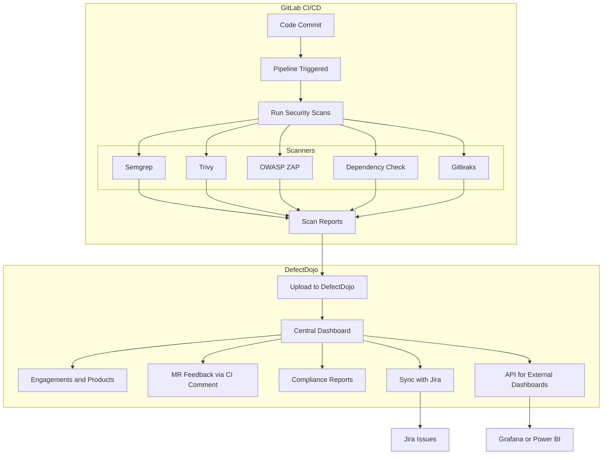

# 🚀 GitLab CI/CD for DevSecOps Engineers

GitLab CI/CD is a powerful automation framework built into GitLab that enables **continuous integration**, **delivery**, and **security testing**. It’s a cornerstone for implementing **DevSecOps** practices by embedding security into every stage of the software lifecycle.

---

## 📘 What Is GitLab CI/CD?

- **CI (Continuous Integration):** Automatically builds and tests code on every commit.
- **CD (Continuous Delivery/Deployment):** Automates release processes to staging or production.
- **DevSecOps Integration:** Security scans are embedded directly into pipelines using GitLab’s built-in or custom modules.

---

## 🧱 Core Components

| Component         | Description                                                                 |
|------------------|-----------------------------------------------------------------------------|
| `.gitlab-ci.yml` | Pipeline configuration file stored in the root of your repo                 |
| **Stages**        | Logical grouping of jobs (e.g., `build`, `test`, `security`, `deploy`)      |
| **Jobs**          | Individual tasks executed in runners (e.g., `run tests`, `scan code`)       |
| **Runners**       | Agents that execute jobs (shared, group, or project-specific)               |
| **Artifacts**     | Files generated by jobs (e.g., reports, binaries)                           |
| **Variables**     | Dynamic values used in jobs (e.g., secrets, environment configs)            |

---
Absolutely, Mohamad! Here's a **GitLab Common Files Cheat Sheet** in Markdown format — perfect for onboarding, documentation, or just keeping your DevSecOps toolkit sharp.

---

# 📁 GitLab Common Files Cheat Sheet

This guide covers frequently used files in GitLab repositories and CI/CD workflows, along with their purpose and usage.

---

## 🧾 `.gitlab-ci.yml`

- **Purpose:** Defines CI/CD pipeline stages, jobs, and scripts.
- **Location:** Root of the repository.
- **Key Features:**
  - `stages`: Defines pipeline flow (`build`, `test`, `deploy`, etc.)
  - `script`: Commands to run in each job
  - `include`: Reuse templates or external configs
  - `artifacts`: Store job outputs
  - `rules` / `only` / `except`: Control job execution

---

## 📄 `README.md`

- **Purpose:** Project overview, usage instructions, and documentation.
- **Location:** Root or any folder.
- **GitLab Behavior:** Automatically rendered on project homepage.

---

## 📄 `.gitignore`

- **Purpose:** Specifies files/folders to exclude from Git tracking.
- **Common Entries:**
  - `node_modules/`
  - `*.log`
  - `.env`

---

## 📄 `.gitattributes`

- **Purpose:** Controls Git behavior for specific files.
- **Use Cases:**
  - Syntax highlighting in diffs
  - Git LFS configuration
  - Linguist language overrides

---

## 📄 `LICENSE`

- **Purpose:** Declares the legal license for the project.
- **GitLab Behavior:** Displayed in project header if detected.

---

## 📄 `CHANGELOG.md`

- **Purpose:** Tracks version history and notable changes.
- **Format:** Semantic versioning or date-based entries.

---

## 📄 `CONTRIBUTING.md`

- **Purpose:** Guidelines for contributing to the project.
- **GitLab Behavior:** Linked automatically in merge requests.

---

## 📄 `Dockerfile`

- **Purpose:** Defines container image build instructions.
- **Used In:** Container scanning, CI/CD jobs, deployments.

---

## 📄 `openapi.yaml` / `swagger.json`

- **Purpose:** API specification files.
- **GitLab Behavior:** Rendered as interactive API docs in UI.

---

## 📄 `.gitlab/ci_templates/*.yml`

- **Purpose:** Reusable CI/CD templates for modular pipelines.
- **Usage:** Included via `include:` in `.gitlab-ci.yml`

---

## 📄 `.gitlab/issue_templates/*.md`

- **Purpose:** Predefined issue formats for bug reports, features, etc.
- **GitLab Behavior:** Available in issue creation dropdown.

---

## 📄 `.gitlab/merge_request_templates/*.md`

- **Purpose:** Standardize merge request descriptions.
- **GitLab Behavior:** Auto-filled when creating MRs.

---

## 📄 `.env` / `.env.example`

- **Purpose:** Environment variable definitions.
- **Note:** Never commit sensitive `.env` files — use `.env.example` for safe sharing.

---

## 📄 `Makefile`

- **Purpose:** Defines build/test/deploy commands.
- **Usage:** Run with `make <target>` in CI or locally.

---

## 📄 `VERSION` / `semver.txt`

- **Purpose:** Stores current version of the project.
- **Used In:** Build scripts, tagging, release automation.

---


## 🛡️ Security Modules for DevSecOps

GitLab provides **built-in security scanning templates** that can be included in your pipeline:

```yaml
include:
  - template: Security/SAST.gitlab-ci.yml
  - template: Security/DAST.gitlab-ci.yml
  - template: Security/Dependency-Scanning.gitlab-ci.yml
  - template: Security/License-Scanning.gitlab-ci.yml
  - template: Security/Secret-Detection.gitlab-ci.yml
```

### 🔍 Key Scanners

| Scanner              | Purpose                                      |
|----------------------|----------------------------------------------|
| **SAST**             | Static code analysis for vulnerabilities     |
| **DAST**             | Runtime scanning of deployed apps            |
| **Dependency Scanning** | Detect vulnerable libraries and packages |
| **License Scanning** | Identify license compliance issues           |
| **Secret Detection** | Find hardcoded secrets in commits            |
| **Container Scanning** | Scan Docker images for CVEs               |
| **IaC Scanning**     | Analyze Terraform/Kubernetes configs         |

---

## 🧪 Sample `.gitlab-ci.yml` with Security Stages

```yaml
stages:
  - build
  - test
  - security
  - deploy

sast:
  stage: security
  script:
    - echo "Running SAST scan"
  include:
    - template: Security/SAST.gitlab-ci.yml

dependency_scan:
  stage: security
  include:
    - template: Security/Dependency-Scanning.gitlab-ci.yml

dast:
  stage: security
  include:
    - template: Security/DAST.gitlab-ci.yml
```

---

## 📊 Visualization & Reporting

- **Security Dashboard:** Centralized view of vulnerabilities across projects
- **Merge Request Reports:** Inline security findings before code is merged
- **Compliance Frameworks:** Enforce policies and audit trails
- **Third-party Integration:** Export findings to tools like DefectDojo, Jira, or dashboards

---

## 🧠 Best Practices for DevSecOps Engineers

- 🔁 **Shift Left:** Run scans early in the pipeline
- 🧩 **Modular Pipelines:** Use reusable components and templates
- 🧹 **Fail Fast:** Break builds on critical vulnerabilities
- 🔐 **Use Vaults/Secrets Management:** Avoid hardcoded credentials
- 📈 **Track Metrics:** Vulnerability trends, remediation velocity, scan coverage

---

# 🛡️ DefectDojo Capabilities for DevSecOps Reporting & Integration

DefectDojo provides a centralized platform to **track, visualize, and export vulnerabilities** across your security pipeline. Below are key features and how to implement them.

---

## 📊 Security Dashboard: Centralized View Across Projects

DefectDojo’s dashboard aggregates findings from all products and engagements.

### 🔹 Features
- Severity breakdown (pie chart & histogram)
- Top/Bottom graded products
- SLA violations and critical findings
- Historical trends by month

### 🔹 How to Use
- Navigate to `Home → Dashboard`
- Customize tiles and charts via `Dashboard Configuration`
- Role-based access ensures users only see data they’re authorized for

📖 [Dashboard Guide](https://docs.defectdojo.com/en/customize_dojo/dashboards/introduction_dashboard/)

---

## 🔍 Merge Request Reports: Inline Security Findings

While DefectDojo doesn’t natively inject findings into Git merge requests, you can achieve this via CI/CD integration:

### 🔹 Strategy
- Run scans (e.g., Semgrep, Trivy) in your pipeline
- Upload results to DefectDojo using API
- Use GitLab/GitHub Actions to fetch findings and comment on MRs

### 🔹 Example Workflow
```yaml
# GitLab CI job
script:
  - semgrep --json > semgrep.json
  - python upload_to_defectdojo.py --report semgrep.json
  - python comment_on_mr.py --findings semgrep.json
```

📖 [Semgrep + DefectDojo Integration](https://semgrep.dev/docs/kb/integrations/defect-dojo-integration)

---

## ✅ Compliance Frameworks: Policies & Audit Trails

DefectDojo supports compliance tracking through:

### 🔹 Features
- Engagement Questionnaires for audit readiness
- SLA tracking per product
- Risk acceptance workflows
- Role-based access and activity logs

### 🔹 How to Use
- Create `Compliance Engagements` with questionnaires
- Use `Accepted Findings` and `Risk Accepted` status
- Export reports for auditors via Report Builder

📖 [Compliance & Reporting Docs](https://docs.defectdojo.com/)

---

## 🔄 Third-party Integration: Jira, Dashboards, DefectDojo API

DefectDojo integrates with external tools for ticketing and visualization.

### 🔹 Jira Integration
- Push findings to Jira as issues
- Bi-directional sync: closing Jira issue closes DefectDojo finding
- Map resolutions to risk acceptance or false positives

📖 [Jira Integration Guide](https://docs.defectdojo.com/en/share_your_findings/jira_guide/)

### 🔹 Dashboarding (Grafana, Power BI)
- Use DefectDojo API to extract metrics
- Feed data into external BI tools for executive dashboards

### 🔹 API Usage
```bash
curl -X POST https://defectdojo.example.com/api/v2/import-scan/ \
  -H "Authorization: Token YOUR_API_TOKEN" \
  -F "file=@semgrep.json" \
  -F "scan_type=Semgrep Scan" \
  -F "product_name=MyApp"
```
 
📖 [API Docs](https://docs.defectdojo.com/en/api-docs/)
---

# 🌐 DevSecOps Pipeline with DefectDojo Integration — Mermaid Diagram



---

## 📌 Diagram Highlights

- **Scanners** feed their results into **DefectDojo** via API
- DefectDojo creates centralized views per **product** and **engagement**
- Findings can be pushed to **Jira**, displayed in **Grafana**, or used for **MR feedback**
- GitLab CI/CD orchestrates everything from code to scan execution

---
Here’s a complete Markdown-based guide that includes:

1. A **Mermaid diagram** to visualize a GitLab DevSecOps pipeline
2. A **cheat sheet** covering `.gitlab-ci.yml` syntax and security template essentials

---

# 🛠️ GitLab DevSecOps Pipeline (Visualized)


📌 *This diagram reflects a shift-left security strategy embedded in a CI/CD pipeline.*

---

# 🧾 `.gitlab-ci.yml` Cheat Sheet for DevSecOps Engineers

## 📁 Basic Syntax Structure

```yaml
stages:
  - build
  - test
  - security
  - deploy

variables:
  ENVIRONMENT: "staging"
  DOCKER_DRIVER: overlay2

job_name:
  stage: build
  script:
    - echo "Build something"
```

---

## ⚙️ Common Keywords

| Keyword       | Purpose                                 |
|---------------|------------------------------------------|
| `stages`      | Defines pipeline flow                    |
| `script`      | Commands to execute                      |
| `artifacts`   | Files to store after job runs            |
| `only`/`except` | Job triggers based on conditions     |
| `tags`        | Assign runners with specific tags        |
| `include`     | Reuse predefined templates               |

---

## 🛡️ Security Templates (Built-In)

Include these to activate built-in GitLab security scanners:

```yaml
include:
  - template: Security/SAST.gitlab-ci.yml
  - template: Security/DAST.gitlab-ci.yml
  - template: Security/Dependency-Scanning.gitlab-ci.yml
  - template: Security/License-Scanning.gitlab-ci.yml
  - template: Security/Secret-Detection.gitlab-ci.yml
  - template: Security/Container-Scanning.gitlab-ci.yml
```

---

## 🧪 Sample Security Stage Block

```yaml
sast:
  stage: security
  allow_failure: true
  artifacts:
    reports:
      sast: gl-sast-report.json

dependency_scan:
  stage: security
  artifacts:
    reports:
      dependency_scanning: gl-dependency-scanning-report.json
```

---

## 🧠 DevSecOps Pro Tips

- 🔁 Scan early: add security checks in pull request pipelines
- 🚧 Use `allow_failure: false` for high-severity blockers
- 📤 Export findings to dashboards or DefectDojo via API
- 🔐 Mask secrets with GitLab CI/CD variables or Vault
- 📉 Track remediation and scan coverage with pipeline badges

---

